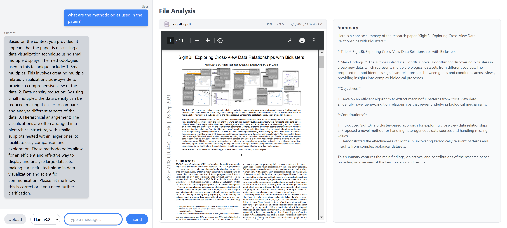

# LLMFlow: Summarization of Documents
LLMFlow integrates GPT with LangChain, DeepSeek and LLama3.2 with Ollama to generate concise summaries of large-scale documents (research documents), reducing reading time and effort for academics. The project enhances accessibility and efficiency in reviewing literature.

This project allows users to upload a **research paper or a document (word, txt, and PDF)**, generate a **summary**, and ask **questions** about its content using various **Large Language Models (LLMs)** such as **Ollama, GPT, and DeepSeek**. 

## Features

- **Upload document** – Supports `.txt``.docx``.pdf` format.
- **Generate Summaries** – Extracts key sections and provides a concise summary.
- **Chat with the Paper** – Ask questions and get AI-generated responses based on the document.
- **Multiple LLMs Supported** – Choose from **Llama, GPT, or DeepSeek** for text processing.
- **Context-Aware Responses** – Retrieves the most relevant sections from the document before answering.

## App Screenshot


---
## Technologies Used

### **Frontend (React)**
- **React.js** – For building the interactive chat interface.
- **Tailwind CSS** – For styling and responsive design.
- **JavaScript (ES6+)** – Used for frontend logic.
- **Fetch API** – For making requests to the backend.
- **React Hooks** (`useState`, `useEffect`, `useRef`) – For managing state and interactions.

### **Backend (FastAPI)**
- **FastAPI** – A modern Python web framework for handling API requests.
- **Uvicorn** – ASGI server to run the FastAPI app.
- **Pydantic** – Data validation for request bodies.
- **CORS Middleware** – Enables cross-origin requests.

### **Large Language Models (LLMs)**
- **Ollama** – Runs local LLMs like `Llama3.2` for chat responses.
- **GPT (OpenAI GPT-4o)** – (Optional) Used via LangChain for advanced processing.
- **DeepSeek** – (Optional) Another LLM used for extraction.

### **File Processing**
- **PDFMiner** – Extracts text from uploaded PDFs.
- **FuzzyWuzzy** – For text similarity matching to find relevant document sections.
- **Regular Expressions (Regex)** – To detect and structure research paper sections.

### **Additional Tools & Libraries**
- **shutil & os** – For file handling.
- **Logging** – For error tracking and debugging.

---

## Installation Guide

### Clone the Repository

```bash
git clone https://github.com/sabdulrahman/LLMFlow.git
cd LLMFlow
```

### Set Up the Backend (FastAPI)

#### Create and Activate a Virtual Environment

```bash
python -m venv venv
source venv/bin/activate  # On Windows use `venv\Scripts\activate`
```

#### Install Dependencies

```bash
pip install -r requirements.txt
```

#### Run the FastAPI Server

On windows open the run.bat file.

```bash
uvicorn main:app --reload
```

The **backend** will be running at: [`http://localhost:8000`](http://localhost:8000)

---

### Set Up the Frontend (React)

```bash
cd frontend
npm install
npm start
```

The **frontend** will be available at: [`http://localhost:3000`](http://localhost:3000)

---

## Usage

1. Open the web interface in your browser at [`http://localhost:3000`](http://localhost:3000).
2. Upload a **PDF research paper**.
3. The system will **generate a summary** of the document.
4. Type your **question** related to the document in the chat.
5. The system retrieves **relevant sections** and generates an **AI-powered response**.

---

## API Endpoints

| Method | Endpoint           | Description |
|--------|-------------------|-------------|
| `POST` | `/upload-file`     | Upload a research paper (PDF) and extract sections. |
| `POST` | `/process-message` | Process user queries with the selected LLM. |
| `GET`  | `/`               | Check if the backend is running. |

---
## Environment Variables
To use **GPT-based processing**, create a `.env` file in the **backend directory** and add:
```
OPENAI_API_KEY=your_openai_api_key
```
---
## Future Improvements
- **Enhanced Document Processing** – Better PDF parsing and section extraction.
- **Multi-Document Support** – Upload and interact with multiple documents.
- **Advanced Query Matching** – Improve accuracy in retrieving document sections.
---
## Contributing
Contributions are welcome! Feel free to open an **issue** or submit a **pull request**.

### License
**MIT License**. See `LICENSE` for more details.
